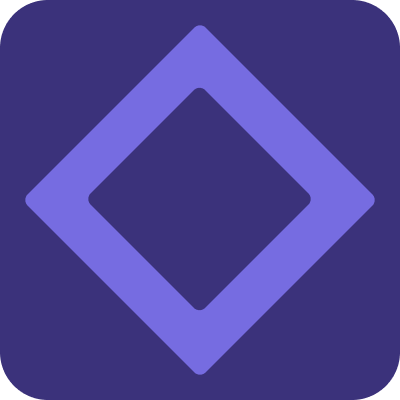

<strong>CodePortal (Alpha) 🚀</strong>

The full-stack programming platform for makers and product teams. A place for all your creations. Simple, powerful, and flexible!

 

<a href="https://codeportal.io">Website</a>
 · 
<a href="https://codeportal.io/discord">Discord</a>

## Introduction

CodePortal is a full-stack AI-first programming platform for makers and product teams who are frustrated with the limitations of traditional programming and tooling. It makes it easier for all team members to make changes to their products, reducing friction, eliminating handoffs and increasing velocity. With CodePortal, you and your teams can create, edit, and deploy web apps, widgets, and APIs faster without installing or configuring anything.

Our goal is to remove as much clutter and unnecessary complexity as possible out of programming. The platform and editor are heavily focused on developer experience, and supporting multiple views of a program. Additionally, they are thought from the ground up to work hand in hand with generative AI.

CodePortal is currently in alpha, so, many of the features are being actively developed, and some are coming soon.

This project has two main parts, the Portal Language (PortalLang), a general purpose programming language, and the CodePortal Platform. Our goals are ambitious and bold! We want to make programming drastically better. This project is based on three core design choices:

- ✨ We should be able to read, modify and navigate code in multiple ways. Like in a block-based UI, a graph view, in a canvas view, in a notebook, and in visual UI builder. Also, these there should be ways to extend these views even further. This makes the system accessible to more people, and makes it easier to understand and to work with. Additionally, it enables new ways of working with code that are not possible with text-based programming. Imagine there is a different representation of the code depending on the task at hand or the person that is interacting with the system.
- 🕸️ Code is stored, modified and managed as a graph of nodes and connections, not as plain text in files and folders. We see this as a more natural medium for code that's easier to work with. It enables a lot of things that are more difficult or impossible with text files, like multiple views, better linked code, tooling and version control (AST-based). Bye, bye, imports! Also, every node is addressable by a unique ID.
- 🔍 There are no files and folders. Everything is interconnected by unique IDs and classified with metadata (tags, types, etc.). We think modern coding is better when it heavily relies on forward and back references, full-text/metadata/semantic search, and system views to explore and understand the code and to find the right code.

The work for the Portal language is happening [here](apps/web/core/PortalLang.md).

Here is what we envision for PortalLang and CodePortal:

- An intuitive and extensible UI for code with support for themes, and plugins ✨.
- AI-first, meaning that it includes code gen, code explain and other AI features.
- An enriched UI with widgets for visualizing and working with data and for debugging it.
- A language that resembles natural language, that's easy to read and to understand. It draws inspiration from Python 🐍.
- Support for translations! The programming language and platform can be translated to any language. This is a big deal for accessibility! 🌎 Localized keywords!!! 🤯
- A full-stack platform, not just a language. It is a complete solution for building web applications and APIs.
- A block-based code editor, not text-based. This makes it easier to work with and more intuitive (no syntax, just UI).
- Automatic import management. No need to import things, or maintain them, the system will do it for you. All of this is easier and automatic because references are by ID not by name! ✨
- Built-in code versioning and collaboration.
- Package manager and marketplace for sharing and installing code.
- Inferred incremental typing ala TypeScript. You can add types if you want, but you don't have to.
- JS/TS ecosystem interop, so you can use any or most JS/TS libraries.
- Content-addressed code ala Unison, see [Unison: 💡 The big idea](https://www.unison-lang.org/learn/the-big-idea/).
- For the server side, it uses an interpreter which allows for instant deployments and updates. No need to recompile or restart the server, [inspired by Darklang](https://blog.darklang.com/how-dark-deploys-code-in-50ms/).

And very interesting things:

- PortalLang has names with spaces, which is the **only right way** to name things! 🌶️ 😉 No more camelCase, snake_case, kebab-case, etc. Inspired by [this Douglas Crockford talk](https://www.youtube.com/watch?v=99Zacm7SsWQ&t=2927s). So, you can name a function, variable or anything just as you would with natural language, no need to remember weird conventions or sacrifice readability.
- PortalLang solved the tabs vs spaces debate! It uses UI space instead! 🤯 🌶️ No need to type it, and it is configurable!

We plan to implement the core parts at first and the others over time. Additionally, we expect to grow and support a strong community around the project and build many of those things together 🚀. To see what parts are being implemented now, check out our [Roadmap](./Roadmap.md).

## Why? (short form)

There is so much clutter in programming right now. And, I don't want to settle with what exists. I want something that truly sparks joy ✨ and that is thought from the ground up to match the experience we expect from our apps today but for our programming tools. I care so much about this that it doesn't matter if we gotta rebuild the whole thing! Lets do it! If you are curious, read the long form of the "why" below. If not, just try the thing! - Carlos Galarza

## Try it!

Go to [codeportal.io](https://codeportal.io), create an account and start using it. It's free to start and then usage based. You can also host it yourself, I will add instructions on how to do that soon. In the meantime, you can check out the code, run it locally, and read how it works below. Also, you can join the [Discord](https://codeportal.io/discord) to get help and chat with other users.

## How does it work?

DISCLAIMER: This is a work in progress, so, things are changing fast and some things are not implemented yet. This is a high level overview of the system. For more details, check out the code.

### The Portal Language

The goal of the Portal Language is to be independent from the CodePortal Platform and be easily embeddable into other systems and platforms. PortalLang is comprised of 4 parts:

- The Code Tree (CT) format.
- The Storage.
- The Editor.
- The Runtime.

**The Code Tree format (CT)**: Ground zero is forgetting about saving code as text. Instead, we save it as what it really is, structured data. We call that the Code Tree (CT). This is the representation of the code as a tree of nodes and connections. In text-based programming, a similar concept is referred to as the AST (Abstract Syntax Tree). However, since there is no syntax here, that name doesn't fit anymore. Additionally, it's a simpler name ✨. The Code Tree is the source of truth. Code is always stored, and modified in this format. It is also the format that is used to run the code. It is JSON based but we will see how this goes as the requirements evolve. I guess we will need an additional format for the Runtime, but that's an optimization for our future selves.

**The Storage**: This is the layer in charge of querying and mutating the Code Tree. It includes various indexes, and a simple API for the Editor to interact with the Code Tree. For now, it is a simple in-memory storage, that we persist as blobs but we will be evolving it as we see fit, maybe into a fully fledged DB, or maybe we will use an existing one 🤔, this is open for analysis/discussion.

**The Editor**: It allows you to explore, understand and modify the Code Tree. This is where a lot of the magic happens 🪄. It is an extensible UI that benefits from the Code Tree graph format and the Storage to give the best DX possible. It enables for multiple representations or views of the code, like the main one which is block-based, the graph view, the canvas view, notebooks and it offers a way to extend these views even further. It also integrates with the Runtime to provide debugging features.

**The Runtime**: It is an interpreter and debugger that runs the Code Tree. In the future we would love explore compilation/partial-generation to JS (or WASM!) for certain parts but for now it is fully interpreted. It also includes the basic functionality of the language, a standard library, the UI framework, the JS interop layer, and the web server.

### The CodePortal Platform

The Platform is our PaaS offering of the Portal Language. Its main parts are:

**The web app:** You can find it inside the `apps/web` folder. It has the API, web UI and handles auth, billing, DB connections, etc. It is a Next.js app hosted on Vercel.

**The worker:** It is in charge of long running tasks (background jobs) both internal and the ones that users create. It is a Node.js app. You can find it inside the `apps/worker` folder. It is hosted on Railway.

**The SDK**: It is a set of libraries to integrate Portal code into other systems. For instance an existing Next.js app to replace a part of it to allow for easy personalization and fast iteration. There are two libraries at the moment:

- `@codeportal/sdk-core`: Pure JS/TS library.
- `@codeportal/sdk-react`: React library.

## Why?! (long form)

I have wanted to code in a better way for a while. A way that removed all the clutter from programming and let me flow and just create stuff. I tried all kinds of things, many programming paradigms, lots of editors, lots of programming languages, even no-code and low-code tools but those are limiting and you sacrifice power and flexibility. I rather use code for things most of the time, however those have their place and I use them when it makes sense.

I never found a good answer! Maybe, I am too picky or too demanding, some people say so! haha! 😅 Also, most approaches and efforts that attempted to radically improve programming have failed or died - I keep a list of them. Some still exist, but they have not gained enough adoption, or they are thriving in a niche. BTW, thriving in a niche is great! It is a good use case for those tools. There are structured editors and visual editors like Blockly, Scratch and Snap but they are mostly for education and/or niche applications not for general purpose development. I tried several others and didn't find what I was looking for. Maybe I needed to build it myself! 🤔

I have learned from all these efforts, from the mistakes, and from the good things. So I decided to set out to create a new programming language and platform. I decided to start from first principles and design something simple, smooth, and with a focus on developer experience. Something that is easy to use and flexible enough to create any type of application without sacrificing power, and flexibility. That is CodePortal! I would not call it no-code because it **IS** code, also is not low-code, because it is very different, there is no code-as-plain-text here! So, I think a proper name for it is **new-code**. It is a new way to code. I borrowed this from the SQL -> NoSQL -> NewSQL evolution, and I think it fits well its purpose. So, this is a new-code tool! Let's build it together!

Carlos Galarza, Founder

## Inspiration

- ["Stop Writing Dead Programs" by Jack Rusher (Strange Loop 2022)](https://www.youtube.com/watch?v=8Ab3ArE8W3s): This talk is amazing! Thanks [Jack](https://github.com/jackrusher)! 🚀
- ["The Future of Programming" by Bret Victor](https://www.youtube.com/watch?v=8pTEmbeENF4): A classic and a must watch! 💾
- ["Moldable development" by Tudor Girba](https://www.youtube.com/watch?v=Pot9GnHFOVU): Having multiple views of a system, and having your dev environment be moldable are big ideas! 💡
- ["The Post JavaScript Apocalypse" by Douglas Crockford](https://www.youtube.com/watch?v=99Zacm7SsWQ): Lots of wisdom here! It sparks joy! ✨ Many hot takes! Like names with spaces! 🌶️ 🤯
- ["Why Dark" by Paul Biggar](https://www.youtube.com/watch?v=66w4Pdp5RhI): Simplifying, and getting rid of accidental complexity! Thinking about the important parts of what we do as an industry. Instant deployments! Live values (trace-driven development)! Some great gems here! 💎
- ["Unison: a new distributed programming language" by Paul Chiusano](https://www.youtube.com/watch?v=gCWtkvDQ2ZI): Content-addressed code is a great idea! 📍
- [Toward a better programming by Chris Granger](https://chris-granger.com/2014/03/27/toward-a-better-programming)

## Local development

See [Local Development.md](./local-dev.md)

## Self Hosting

See [Self Hosting.md](./self-hosting.md)

## Tech

CodePortal is built using:

- Next.js / React
- shadcn/ui.
- Tailwind CSS.
- TypeScript / Node.js
- [Turborepo](https://turbo.build/repo)
- [Pnpm](https://pnpm.io/)

## Contributing

Work in progress. I will add more details soon.
